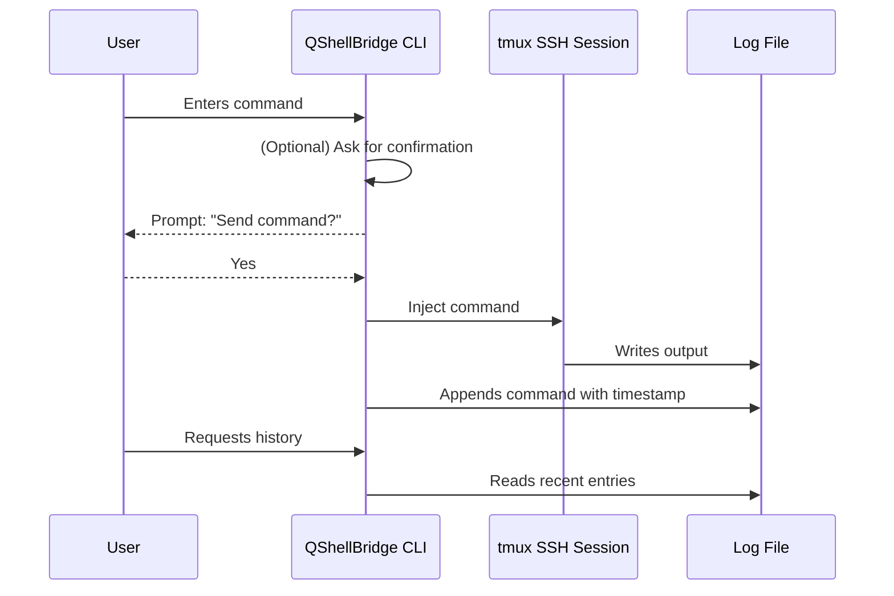
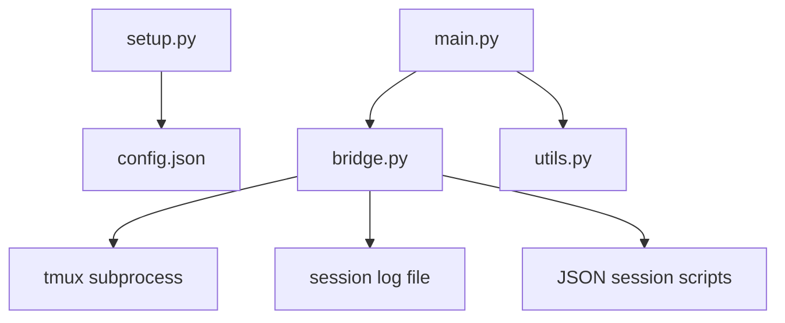

# 🧠 QShellBridge
<p align="center">
  
</p>
 
**Created by [Suren's Creations © 2025](https://github.com/spetro511)**  
[GitHub: @spetro511](https://github.com/spetro511)

---

## 🚀 Overview

`QShellBridge` is a powerful, neon-styled terminal utility designed to bridge local automation tools (like Amazon Q) with live remote SSH sessions. It works by injecting commands into a `tmux` session, enabling intelligent agents to operate your terminal environment as if they were typing live.

**Key Capabilities:**
- ✅ Direct command injection into a live SSH session via `tmux`
- 🧠 Save and reload full command session scripts
- 📺 Live terminal output viewing in real-time
- 🪞 Mirror full terminal output to log files
- 🕶 Neon-themed CLI interface with `rich`

---

## 📦 Features

### 🔌 Command Injection
Use `tmux send-keys` to send commands into a named terminal session running an SSH connection.

### 💾 Save / Load Sessions
Use session files (`~/.qshellbridge_sessions/`) to store full lists of shell commands for reuse.

### 📡 Terminal Output Mirroring
Automatically mirror everything from the terminal into a designated log file via `tmux pipe-pane`.

### 📺 Live Log Tail
Watch your terminal logs update in real time using `rich.live.Live` interface.

### 🛡️ Command Confirmation Mode
Enable a prompt to confirm each command before it's sent to the remote session.

### 📜 Command History Viewer
View recent commands that were sent during the session. Useful for reviews or replays.

### 💬 Interactive Command Sessions
Launch an interactive prompt that lets you enter and confirm commands one at a time with real-time logging.

---

## ⚙️ Requirements

- Python 3.8+
- `tmux` installed on your system
- `rich` Python library

Install with:
```bash
pip install -r requirements.txt
```

---

## 🛠 Setup

Run the interactive setup script:
```bash
python setup.py
```

You'll be prompted to:
- Paste your SSH connection string (e.g., `ssh -i ~/.ssh/key -p 22 user@host`)
- Choose a log directory (supports external volumes)
- Auto-generate a `tmux` session name based on your SSH address

Then, start your SSH session:
```bash
tmux new -s [session-name] '[ssh command]'
```

Finally, launch the QShellBridge interface:
```bash
python main.py
```

---

## 📂 Project Structure

```
qshellbridge/
├── bridge.py         # Core logic for tmux and log/session handling
├── setup.py          # Interactive configuration wizard
├── main.py           # Command prompt and entrypoint
├── requirements.txt  # Python dependencies
├── README.md         # You are here!
└── sessions/         # Auto-created directory for saved command sessions
```

---

## 🔮 Future Features

- [ ] Auto-response parsing
- [x] Command confirmation mode
- [ ] API/Socket layer for remote triggers

---

## 🧠 Inspiration

This tool was built to support AI-powered workflows where you want your assistant to interact with a live terminal session—safely, logged, and fully scriptable.

---

## 👑 Created by

**[Suren's Creations © 2025](https://github.com/spetro511)**  
🔗 [GitHub: @spetro511](https://github.com/spetro511)

---

## 🔧 System Flow (Mermaid Diagram)

```mermaid
flowchart TD
    A[Local System (User)] -->|Runs setup.py| B[Setup Configuration]
    B -->|Starts SSH Session via tmux| C[tmux SSH Session]
    A -->|Runs main.py| D[QShellBridge CLI]
    D -->|Sends command to| C
    C -->|Output to log file| E[Session Log File]
    D -->|Live Tail / History / Interactive| E
    D -->|Save or Load| F[Command Session Scripts]
    C -->|Optional| G[Output Mirroring Log]
```

### ▶️ Sequence Diagram (Command Lifecycle)



### 🧱 Architecture Overview (Component-Level)


